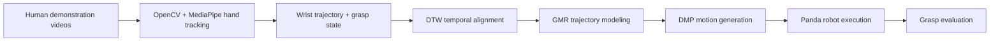

# Learning from Demonstration for Robotic Manipulation

> **ECEN 524 — Robot Learning, Project 2**  
> Learning a reusable block-grasping trajectory from human video demonstrations and reproducing it on a Panda robotic arm.

[](https://colab.research.google.com/github/sdsharma1469/RobotLearning_project2/blob/main/ECEN524_Project2.ipynb)

## Project Overview

This project implements an end-to-end **Learning from Demonstration (LfD)** pipeline for robotic manipulation. Human block-grasping demonstrations are recorded on video, converted into hand trajectories and grasp states, aligned across demonstrations, modeled into a representative motion, and transformed into a smooth trajectory for robot execution.

The pipeline combines computer vision with three core robot-learning techniques:

- **Dynamic Time Warping (DTW)** for temporal alignment
- **Gaussian Mixture Regression (GMR)** for learning a representative trajectory
- **Dynamic Movement Primitives (DMPs)** for smooth motion reproduction

## Pipeline



### 1. Demonstration Processing
Human block-grasping demonstrations are processed frame by frame using **OpenCV** and **MediaPipe**. The active hand's wrist position is extracted to form the motion trajectory.

The distance between the thumb tip and index-finger tip is also tracked. A smoothed hysteresis-based threshold converts this signal into an **OPEN / CLOSED** grasp state that can be synchronized with the learned trajectory.

### 2. Temporal Alignment — DTW
Different people perform the same grasp at different speeds. **Dynamic Time Warping** aligns the recorded demonstrations in time so corresponding portions of the motion can be compared and learned together.

### 3. Trajectory Learning — GMR
After alignment, **Gaussian Mixture Regression** is used to estimate a representative trajectory from the demonstrations rather than simply replaying one recorded motion.

### 4. Motion Reproduction — DMP
The learned trajectory is represented with **Dynamic Movement Primitives**, producing a smooth and reusable motion that can be executed by the robot.

### 5. Robot Evaluation
The generated trajectory is reproduced on a **Panda robotic arm** and evaluated based on whether the robot successfully completes the block grasp.

## Results

| Metric | Result |
| --- | ---: |
| Human demonstrations processed | **10** |
| Validation trials | **13** |
| Grasp completion rate | **70%** |

The experiment shows that a manipulation behavior can be learned from multiple human demonstrations and transferred into a reusable robot trajectory, while also highlighting the sensitivity of grasp success to demonstration quality, trajectory estimation, and robot execution accuracy.

## Technologies

`Python` · `OpenCV` · `MediaPipe` · `NumPy` · `pandas` · `DTW` · `Gaussian Mixture Regression` · `Dynamic Movement Primitives`

## Repository Structure

```text
RobotLearning_project2/
├── ECEN524_Project2.ipynb   # Complete Colab pipeline and experiments
├── README.md                # Project documentation
└── .gitignore
```

## Run the Project

The notebook is designed to run in **Google Colab**.

1. Click the **Open in Colab** badge above.
2. Mount Google Drive when prompted.
3. Set `VIDEO_DIR` to the folder containing the demonstration videos.
4. Run the notebook cells from top to bottom.

The notebook installs its required computer-vision dependencies within the Colab environment.

## Key Takeaway

Rather than directly replaying a single demonstration, this project builds a complete **demonstration → perception → alignment → learning → robot execution** pipeline. The combination of DTW, GMR, and DMPs enables the robot to learn a generalized grasping motion from a collection of human examples.
