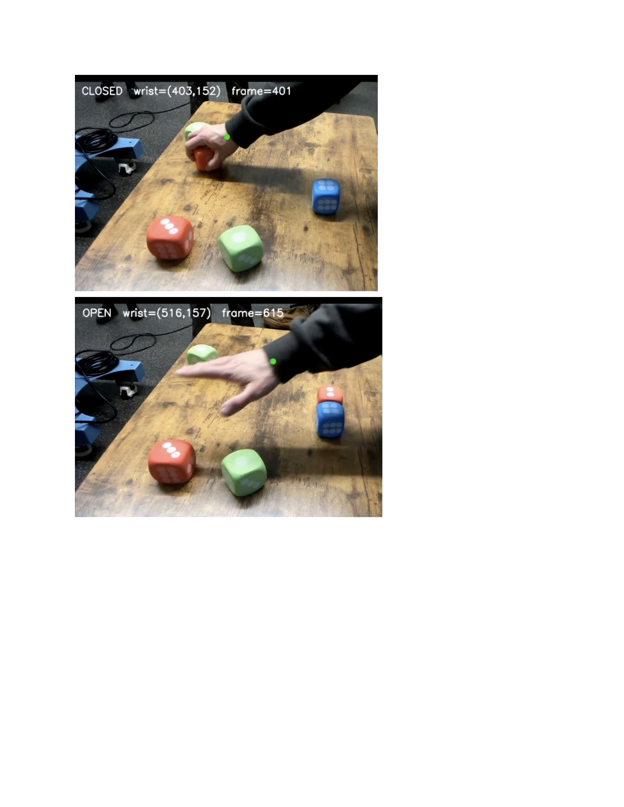
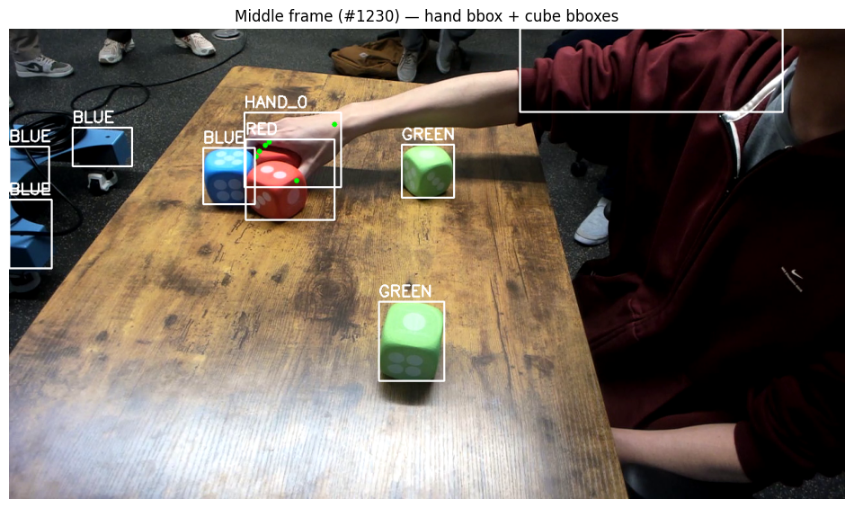

# Learning Block-Placement Policies from Video Demonstrations

> **ECEN 524 — Robot Learning, Project 2**

This project converts human block-manipulation videos into symbolic grab/release
events, learns the demonstrated color-placement order, and solves a finite Markov
Decision Process (MDP) to recover the optimal placement policy.

[](https://colab.research.google.com/github/sdsharma1469/RobotLearning_project2/blob/main/ECEN524_Project2.ipynb)

## What the project implements

```text
RGB demonstration videos
        │
        ├── MediaPipe Hand Landmarker ──> wrist/pinch landmarks ──> OPEN/CLOSED state
        │
        └── HSV color segmentation ─────> red/green/blue cube detections
                                                │
                               timestamp + nearest-object association
                                                │
                                      GRAB/RELEASE event log
                                                │
                                      demonstrated color order
                                                │
                                        MDP + value iteration
                                                │
                                      optimal placement policy
```

The repository contains the perception and discrete-policy portions presented as
Parts B and C of the supplied project report. It does **not** contain DTW, Gaussian
Mixture Regression, Dynamic Movement Primitives, or Panda-arm execution code.

## Part B — Hand and object recognition

### Hand-state inference

The notebook uses the MediaPipe Hand Landmarker to detect normalized 3D hand
landmarks in each RGB frame. For the active hand, it records the wrist, thumb tip,
and index-finger tip. The thumb–index distance is smoothed with a seven-frame rolling
window and converted into `OPEN` or `CLOSED` using hysteresis thresholds derived from
the 20th and 60th percentiles of the recording.

Higher-level manipulation events are inferred from these compact hand states rather
than training a separate action classifier.

<p align="center">
  
  <br>
  <sub>Detected CLOSED and OPEN states with tracked wrist locations (report frames 401 and 615).</sub>
</p>

### Colored-cube detection

Red, green, and blue cubes are segmented in HSV color space. Median filtering and
morphological opening/closing reduce mask noise, contours below 800 pixels are
discarded, and remaining objects are represented by bounding boxes and centroids.
The nearest detected cube to the hand pinch point is associated with a grasp event.

<p align="center">
  
  <br>
  <sub>MediaPipe hand bounding box/keypoints combined with HSV-derived cube detections.</sub>
</p>

### Event log reported in the experiment

| Time (s) | Frame | Event | Object | Hand–object distance (px) |
|---:|---:|:---|:---|---:|
| 2.13 | 64 | GRAB | `RED_1` | 42.7 |
| 3.05 | 92 | RELEASE | `RED_1` | — |
| 4.22 | 127 | GRAB | `GREEN_2` | 35.3 |
| 5.10 | 153 | RELEASE | `GREEN_2` | — |
| 6.41 | 192 | GRAB | `BLUE_1` | 38.9 |
| 7.32 | 219 | RELEASE | `BLUE_1` | — |
| 8.75 | 262 | GRAB | `RED_2` | 40.1 |
| 9.60 | 288 | RELEASE | `RED_2` | — |
| 10.91 | 327 | GRAB | `GREEN_1` | 44.6 |
| 11.85 | 355 | RELEASE | `GREEN_1` | — |

This produces the demonstrated release order:

```text
R → G → B → R → G
```

## Part C — MDP and value iteration

The event-derived sequence defines a deterministic finite MDP:

- **State `k`:** number of correctly placed blocks, from `0` through `N`.
- **Actions:** place a red (`R`), green (`G`), or blue (`B`) block.
- **Correct transition:** advance from `k` to `k + 1`.
- **Incorrect transition:** remain at `k` and receive a penalty.
- **Goal:** reach terminal state `N` after completing the demonstrated sequence.
- **Discount factor:** `γ = 0.95`.

In the executable notebook, a correct non-terminal placement returns `0.9`
(`+1 - 0.1` step cost), the goal transition returns `9.9`, and an incorrect action
returns `-0.5`. Value iteration uses at most 200 iterations and a convergence
tolerance of `1e-8`.

### Learned policy and rollout

| State | Correct action | Reward | Next state |
|---:|:---:|---:|---:|
| 0 | R | 0.9 | 1 |
| 1 | G | 0.9 | 2 |
| 2 | B | 0.9 | 3 |
| 3 | R | 0.9 | 4 |
| 4 | G | 9.9 | 5 |
| 5 | TERMINATE | 0.0 | 5 |

The rollout reaches the goal in five decisions with no incorrect placement.

> **Report consistency note:** the report's final text diagram uses an illustrative
> hard-coded sequence `G → R → B → R → G`, while the event table and executed
> value-iteration output produce `R → G → B → R → G`. This README reports the
> data-derived, executed result.

## Technologies

`Python` · `OpenCV` · `MediaPipe` · `NumPy` · `pandas` · `Matplotlib` · `Value Iteration`

## Repository structure

```text
RobotLearning_project2/
├── ECEN524_Project2.ipynb
├── README.md
└── docs/
    └── images/
        ├── hand-cube-detection.png
        └── hand-state-detection.png
```

## Running the notebook

The notebook is designed for Google Colab:

1. Open it using the badge above.
2. Mount Google Drive.
3. Set `VIDEO_DIR` to a directory containing the demonstration videos.
4. Run the cells in order.
5. Supply the generated/curated `events.csv` before running the MDP cells.

The notebook installs MediaPipe, OpenCV, and pandas in the Colab environment and
downloads the MediaPipe Hand Landmarker model when needed.

## Limitations

- HSV thresholds may require retuning when lighting or camera conditions change.
- Centroid-based object association can be confused by occlusion or nearby objects.
- The MDP assumes deterministic transitions and an already extracted target order.
- The provided notebook depends on external demonstration videos and `events.csv`,
  which are not committed to this repository.
